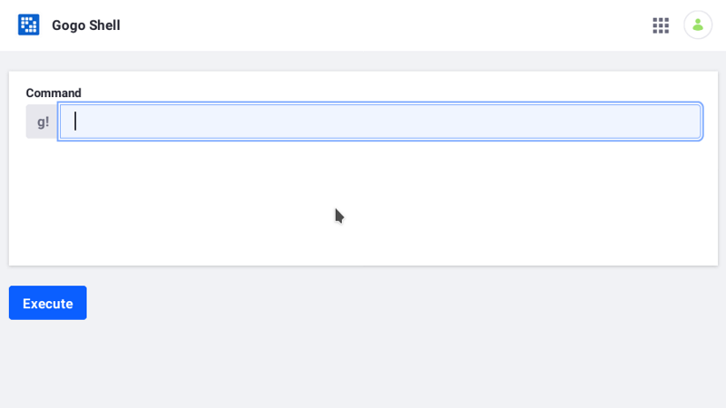
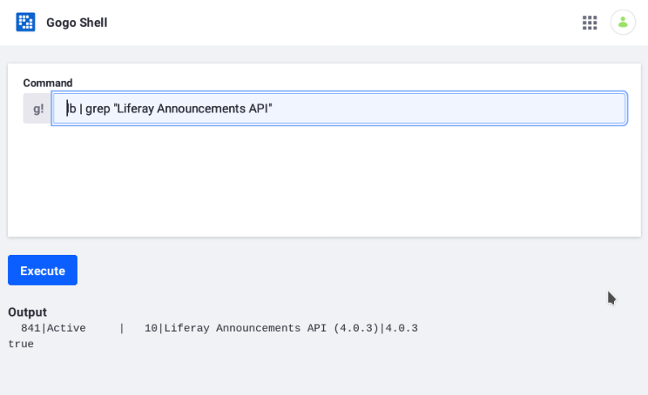

# Using the Gogo Shell

The Gogo shell provides a way to interact with the module framework. Among other things, you can

* Dynamically install/uninstall bundles (modules)
* Examine package dependencies
* Examine extension points
* List service references

The Control Panel is the safest, most secure way to access Gogo shell:

1. Open the *Global Menu* ().

1. Select the *Control Panel* tab.

1. Click *Gogo Shell* in the System section.

   The Gogo shell command screen appears.

   

    ```note::
       In DXP 7.2, open the Control Panel and navigate to *Configuration* &rarr; *Gogo Shell*
    ```

1. Enter a Gogo shell command in the *g!* text field. For example, enter `lb | grep "Liferay Announcements API"` to list information about the Announcements API bundle.

1. Click *Execute*.

    The command result output appears.

    

```warning::
   The Gogo shell is extremely powerful and can manipulate the platform's core functionality. Only grant Gogo shell access to trusted administrators. Please see `Understanding Roles and Permissions <../../users-and-permissions/roles-and-permissions/understanding-roles-and-permissions.md>`_ for more information.
```

## Conclusion

Now that you know how to run Gogo shell, explore the available [Gogo shell commands](./gogo-shell-commands). If you're working in a developer environment, consider Gogo shell from the command line. See [Command Line Gogo Shell](./command-line-gogo-shell.md) for more information.
