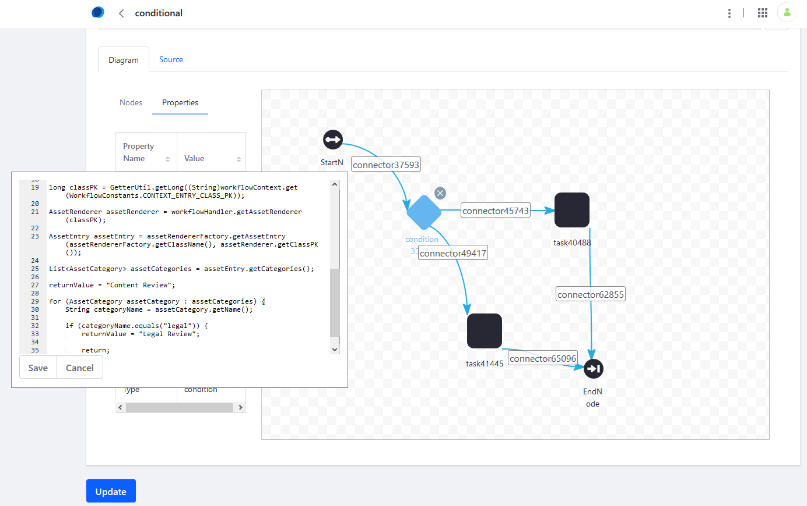
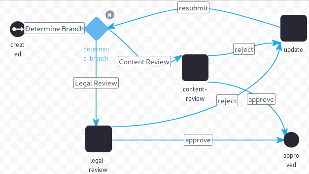

# Condition Node Reference

This tutorial documents how to use the _Condition_ Node.

You might have a review process that requires you to determine which reviewer needs to review the asset. For example, depending on the type of document, it might require review by the legal department or the Marketing team.

In Workflow Designer, users can add a _Condition_ node to reflect this check in the workflow process. Much like [Fork and Join nodes](./using-forks-and-joins.md) node, a _Condition_ node splits the review path. However, unlike the _Fork_ node which requires the corresponding _Join_ node, the _Condition_ node checks whether certain conditions are met before determining the appropriate review path.

For demonstration purposes, we are using the [Category Specific Definition](../workflow-designer-overview/workflow-processes/category-specific-definition.xml). Furthermore, we are importing a sample Groovy script which checks the asset and determines the path for the desired reviewer.

Follow the steps below:

1. Navigate to the _Control Panel_ &rarr; _Workflow_ &rarr; _Process Builder_.
1. Click the () to add a new workflow.
1. In the Workflow Designer Canvas, enter a name for the workflow.
1. Delete the old connector between the _Start_ and _End_ node.
1. Drag and drop the _Condition_ node.
1. Connect the _Start_ node to the _Connection_ node.
1. Double Click on the _Condition_ node to configure the node's properties.
1. Click _Value_ next to _Script_.
1. Enter the following into the dialog box:

    ```java
    import com.liferay.asset.kernel.model.AssetCategory;
    import com.liferay.asset.kernel.model.AssetEntry;
    import com.liferay.asset.kernel.model.AssetRenderer;
    import com.liferay.asset.kernel.model.AssetRendererFactory;
    import com.liferay.asset.kernel.service.AssetEntryLocalServiceUtil;
    import com.liferay.portal.kernel.util.GetterUtil;
    import com.liferay.portal.kernel.workflow.WorkflowConstants;
    import com.liferay.portal.kernel.workflow.WorkflowHandler;
    import com.liferay.portal.kernel.workflow.WorkflowHandlerRegistryUtil;

    import java.util.List;

    String className = (String)workflowContext.get(WorkflowConstants.CONTEXT_ENTRY_CLASS_NAME);

    WorkflowHandler workflowHandler = WorkflowHandlerRegistryUtil.getWorkflowHandler(className);

    AssetRendererFactory assetRendererFactory = workflowHandler.getAssetRendererFactory();

    long classPK = GetterUtil.getLong((String)workflowContext.get(WorkflowConstants.CONTEXT_ENTRY_CLASS_PK));

    AssetRenderer assetRenderer = workflowHandler.getAssetRenderer(classPK);

    AssetEntry assetEntry = assetRendererFactory.getAssetEntry(assetRendererFactory.getClassName(), assetRenderer.getClassPK());

    List<AssetCategory> assetCategories = assetEntry.getCategories();

         returnValue = "Content Review";

    for (AssetCategory assetCategory : assetCategories) {
    String categoryName = assetCategory.getName();

    if (categoryName.equals("legal")) {
        returnValue = "Legal Review";

        return;
        }
    }

    ```

    

1. Click _Save_.
1. Add two _Task_ nodes then connect the _Condition_ node to them. Rename them as:

    * Legal Review
    * Content Review

1. Add a third _Task_ node; renamed this node as _Update_. This _Task_ node is the asset creator to update the asset if it is rejected.
1. Connect the _Update_ node back to the _Condition_ node.
1. Rename all the connectors and add any additional [actions or notifications](./configuring-workflow-actions-and-notifications.md).

    

1. Click _Publish_ when finished.

The new workflow has been created.

```tip::
   The `returnValue` variable is the variable that points from the condition to a transition, and its value must match a valid transition in the workflow definition.
```

## Additional Information

* [Managing Workflows](../managing-workflows.md)
* [Using Forks and Joins](./using-forks-and-joins.md)
* [Workflow Designer Reference Guide](./workflow-designer-reference-guide.md)
