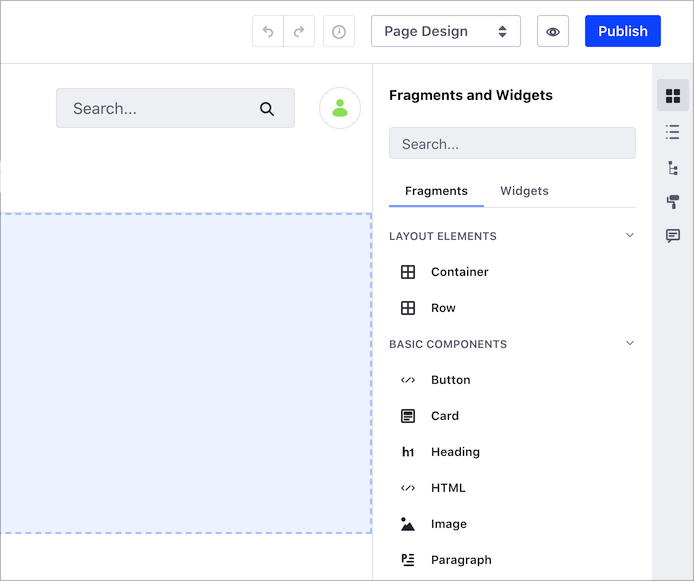

# Creating a Master Page Template

> Available: Liferay DXP 7.3+

Although Portal includes default Master Page Templates that you can use to define the look and feel of the Headers and Footers for your site's pages, you may want a more custom solution. You can create custom Master Page Templates for this.

Follow these steps to create a Master Page Template:

1. Open Product Menu and go to Site &rarr; *Site Builder* &rarr; *Page Templates*.
1. Under the *Masters* tab, click the add button to create a new Master Page Template.

    

1. Add Page Fragments for the common elements that you require.

    

1. Optionally drag and drop the Drop Zone to a new location in the layout. For example, you can add a row with two columns and move the Drop Zone to one column, so users can only add Page Fragments to that portion of the page.

    

1. Optionally specify which Page Fragments can be added to the Drop Zone by clicking the *Configure Allowed Fragments* button. Check the boxes for the Page Fragments you want to allow. Check the box for *Allow New Fragments* to allow new Page Fragments to be added to the Drop Zone. click *Save* to apply the changes.

    

1. Click Publish to create the Master Page Template.

```note::
  If a custom Master Page Template is used for a page, the Theme for the page is defined through the Master Page Template and can't be changed through the page's settings. See `Changing a Master Page Template's Theme <./managing-master-pages.md#changing-a-master-page-template-s-theme>`_ for more information.
```
