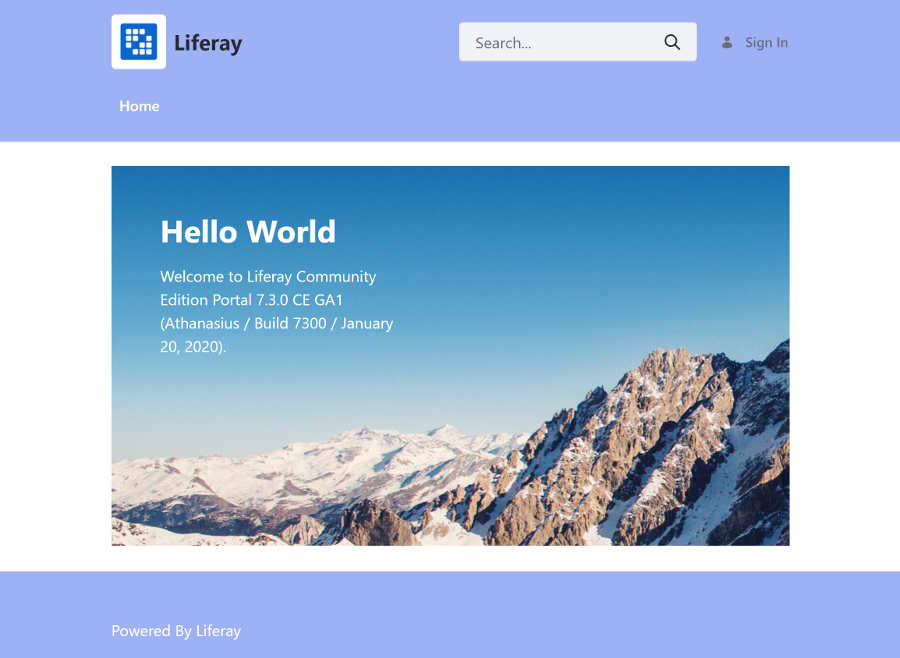

# Developing a Theme

Themes are packaged WAR files composed of CSS, HTML (FreeMarker), and JavaScript that can be used to create a custom look and feel for pages.

Here, you'll learn how to develop a Theme with the Liferay JS Themes Toolkit:

1. [Deploy a Theme](#deploy-a-theme)
1. [Modify the Theme and Redeploy](#modify-the-theme-and-redeploy)

This example uses a Docker image with a fresh install of Liferay DXP.

## Deploy a Theme

First, deploy an example Theme:

1. Run the command below to start the Docker container:

    ```bash
    docker run -it -p 8080:8080 liferay/portal:7.3.4-ga5
    ```

1. Download and unzip the [example Theme](https://learn.liferay.com/dxp/7.x/en/site-building/developer-guide/developing-themes/liferay-g4t8.zip):

    ```bash
    curl https://learn.liferay.com/dxp/7.x/en/site-building/developer-guide/developing-themes/liferay-g4t8.zip
    ```

    ```bash
    unzip liferay-g4t8.zip
    ```

1. [Install the Liferay Theme Generator](../reference/themes/installing-the-theme-generator-reference.md).

1. Navigate to the `/g4t8-impl` folder and run the command below to generate the example Theme:

    ```bash
    yo liferay-theme:classic --config config.json
    ```

1. Replace the `/g4t8-impl/liferay-g4t8-theme/src/css/_custom.scss` file with the `/g4t8-impl/_custom.scss` file.

1. Replace the `/g4t8-impl/liferay-g4t8-theme/src/templates/portal_normal.ftl` file with the `/g4t8-impl/portal_normal.ftl` file.

1. Replace the `/g4t8-impl/liferay-g4t8-theme/src/images/thumbnail.png` file with the `/g4t8-impl/thumbnail.png` file.

1. Navigate back to the `/liferay-g4t8/` folder and build and deploy the Theme.

    ```bash
    cd ../liferay-g4t8
    ```

    ```bash
    .\gradlew deploy -Ddeploy.docker.container.id=$(docker ps -lq)
    ```

    ```note::
      If testing on Windows, you may need to build the module first with ``.\gradlew build`` and then manually copy the JAR to ``docker cp .\g4t8-impl\liferay-g4t8-theme\dist\liferay-g4t8-theme.war docker-container-name:/opt/liferay/osgi/war`` directly if deployment fails.
    ```

1. Confirm the deployment to the Liferay Docker container console. The log message below should appear in the Docker console:

    ```bash
    INFO  [fileinstall-/opt/liferay/osgi/war][BundleStartStopLogger:46] STARTED liferay-g4t8-theme_1.0.0 [1180]
    ```

1. Verify that the Theme is available. Visit `https://localhost:8080`, open the Product Menu, and go to *Site Builder* &rarr; *Pages*. Click the () next to Public Pages.

1. Scroll down and click the *Change Current Theme* button. Click the ACME Pastel Purple Theme thumbnail next to the Classic Theme.

   

1. Click *Save* to apply the changes, and go back to the home page.

   

Great! You successfully deployed and applied a Theme. Next you can review the example Theme and learn how it's built. See the [Theme Anatomy reference](../reference/themes/theme-anatomy-reference.md) for a complete listing of the files included in a Theme and their usage.

## Theme Breakdown

The ACME Purple Pastel Theme was generated with the [Liferay JS Themes Toolkit's](https://github.com/liferay/liferay-js-themes-toolkit) [Liferay Theme Generator](../reference/themes/installing-the-theme-generator-reference.md). It's based on the Classic Theme, created with the Classic [Sub-generator](../reference/themes/installing-the-theme-generator-reference.md#generator-and-sub-generator-commands):

```bash
yo liferay-theme:classic
```

```note::
  The ``liferay-theme:classic`` sub-generator is available for Liferay DXP 7.2+ in v9.50+ of the Liferay JS Themes Toolkit.
```

Once the Theme was generated, its base files were built using the [Liferay JS Themes Toolkit Workflow](../reference/themes/liferay-js-themes-toolkit-theme-development-workflow.md). The example Theme's updates are described in more detail below.

### The themes CSS Stylesheet

Custom CSS is placed in `_custom.scss`. In this case, the example styles change the background color of the header and footer and update the font color of the navigation/ links. See [Understanding the Page Structure](../reference/themes/understanding-the-page-structure.md) for more information on the various elements and IDs you can target for styling. Styles are condensed using [Sass](https://sass-lang.com/) syntax, as demonstrated by the nested styles in the CSS below:

```scss
body header .navbar-classic {
  background-color: #9EB1F5;
  
  &.navbar-light {
    ul > li > a.nav-link.text-truncate {
      color: #FFF;
    }
  }
}
...
body #footer {
	background-color: #9EB1F5;
}
```

### The Theme's HTML

The HTML markup is contained in a set of FreeMarker Theme Template files. See the [Look and Feel Overview](../reference/look-and-feel-overview.md#theme-building-utilities) for more information on the available Theme Templates and their functionality. `portal_normal.ftl` provides the global layout of the Site. It is responsible for rendering the markup you see on the page and includes all the Theme templates. 

As deployed, the theme adds a new button to the Header markup beside the User Personal Bar in `portal_normal.ftl`:

```markup
...
<div class="autofit-col">
  <@liferay.user_personal_bar />
</div>

<div class="ml-3 autofit-col">
  <button name="Alert Button" onclick="alert('You pushed the button.')" class="btn btn-primary">Alert</button>
</div>
...
```

### The Theme's JavaScript

The `main.js` file is the primary file that includes JavaScript in your Theme. You can of course include external JavaScript files as well by including their scripts in a Theme Template (`portal_normal.ftl` for instance) as you would a traditional site's HTML.

```note::
  JavaScript can also be included through the Site's `Page Set <../../creating-pages/page-settings/configuring-page-sets.md#javascript>`_ and `individual Page <../../creating-pages/page-settings/configuring-individual-pages.md#javascript>`_ settings.
```

The example includes JavaScript in the `main.js` file that prints a message in the browser's console when the Theme is loaded on the page:

```javascript
console.log('My Theme is loaded to the page.');
```

## Modify the Theme and Redeploy

Since the alert button doesn't do anything important, you'll modify the Theme to remove the alert button. 

1. Open the Theme's `portal_normal.ftl` template to modify the page's HTML markup.
1. Remove the button markup in the Header shown below and save the file:

    ```markup
    <div class="ml-3 autofit-col">
      <button name="Alert Button" onclick="alert('You pushed the button.')" class="btn btn-primary">Alert</button>
    </div>
    ```

1. Build the Theme's WAR as you did before.

    ```bash
    cd liferay-g4t8
    .\gradlew deploy -Ddeploy.docker.container.id=$(docker ps -lq)
    ```

    ```note::
      If testing on Windows, you may need to build the module first with ``.\gradlew build`` and then manually copy the JAR with ``docker cp .\g4t8-impl\liferay-g4t8-theme\dist\liferay-g4t8-theme.war docker-container-name:/opt/liferay/osgi/war`` directly if deployment fails.
    ```

1. Confirm the deployment to the Liferay Docker container console:

    ```bash
    INFO  [fileinstall-/opt/liferay/osgi/war][BundleStartStopLogger:46] STARTED liferay-g4t8-theme_1.0.0 [1141]
    ```

1. Refresh the home page to view the changes. The button is gone. 


Congratulations! Now you know how to develop and deploy a Theme to Liferay DXP using the Liferay JS Themes Toolkit.

## Related Information

* [Installing the Theme Generator](../reference/themes/installing-the-theme-generator-reference.md)
* [Theme Development Workflow](../reference/themes/liferay-js-themes-toolkit-theme-development-workflow.md)
