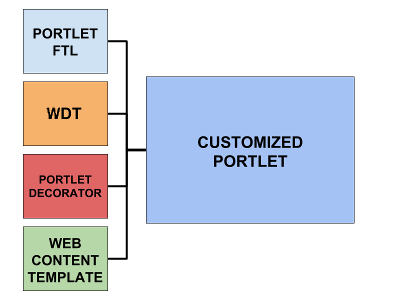

# Look and Feel Overview

You can create a Theme, create a Themelet, or customize the look and feel of individual widgets.

```note::
  You can also control the look and feel of Headers and Footers in Liferay DXP 7.3+ using Master Pages. See `Master Page Templates <../../creating-pages/defining-headers-and-footers/master-page-templates.md>`_.
```

## Themes

Themes use standard components (CSS, JavaScript, and HTML) along with FreeMarker templates for rendering. Themes are built on top of either the *Unstyled* base Theme (provides basic markup, functions, and images for Liferay DXP) or the *Styled* base Theme (inherits from the Unstyled base Theme and adds some styling on top).

There are several [default FreeMarker templates](#theme-building-utilities) that each handle a key piece of functionality for the page. There are also [Theme template utilities](#theme-building-utilities) that let you use widgets, taglibs, Theme objects, and more in your Theme templates. You can use the [Theme Generator](../reference/installing-the-theme-generator-reference.md) to create the required files and structure for developing a Theme.

### Theme Components

Theme templates, along with the CSS, can provide much of the overall look and feel for the page, but additional extension points/customizations are available for Themes. These extensions and mechanisms are available for Themes:

* **Color Schemes:** Specifies configurable color scheme settings Administrators can configure via the Look and Feel menu. See [color schemes](../../customizing-configuration-settings/creating-color-schemes-for-your-theme.md) for more information.
* **Configurable Theme Settings:** Administrators can configure aspects of a Theme that change frequently, such as the visibility of certain elements, changing a daily quote, etc. See [Configurable Theme Settings](../../customizing-configuration-settings/adding-configurable-theme-settings.md) for more information.
* **Context Contributor:** Exposes Java variables and functionality for use in FreeMarker templates. This allows non-JSP templating languages in themes, widget templates, and any other templates. <!--See the [Context Contributors tutorial](TODO) for more information.-->
* **Theme Contributor:** A package containing independent UI resources (CSS and JavaScript), not attached to a Theme, that you want to include on every page. The Control Menu, Product Menu, and Simulation Panel are included inside Theme Contributors because they are required for every page, regardless of what Theme is currently applied. To modify them, you must create your own Theme Contributor to override the default styles and behavior. <!--See the [Theme Contributors tutorial](TODO) for more information.-->
* **Themelet:** Small, extendable, and reusable pieces of code containing CSS and JavaScript. They can be shared with other developers to provide common components for Themes. See [Developing Themelets](./developing-themelets.md) for more information.

### CSS Frameworks and Extensions

Themes support [SASS](https://sass-lang.com/), so you can take advantage of Sass features (mixins, nesting, partials, and variables) in your CSS.

Also important to note is [Clay CSS](https://clayui.com/), the web implementation of Liferay's [Lexicon design language](https://liferay.design/lexicon/). An extension of Bootstrap, Clay CSS fills the gaps between Bootstrap and the needs of Liferay DXP, providing additional components and CSS patterns that you can use in your themes. <!--Clay base, Liferay's Bootstrap API extension, along with Atlas, a custom Bootstrap Theme, creates the Classic Theme. See [Customizing Atlas and Clay Base Themes](TODO) for more information.-->

### Theme Building Utilities

The default FreeMarker templates provide helpful utilities and handle key pieces of page layout (page) functionality:

* `portal_normal.ftl`: Similar to a static site's `index.html`, this file is the hub for all the Theme templates and provides the overall markup for the page.
* `init.ftl`: Contains variables commonly used throughout the Theme templates. Refer to it to look up Theme objects. <!--For convenience, the [FreeMarker Variable Reference Guide](TODO) lists the objects.--> **DO NOT override this file**.
* `init_custom.ftl`: Overrides FreeMarker variables in `init.ftl` and to define new variables, such as [Theme settings](../../customizing-configuration-settings/adding-configurable-theme-settings.md).
* `portlet.ftl`: Defines the markup for the Theme's widgets. If your Theme uses Portlet Decorators, modify this file to create application decorator-specific Theme settings.
* `navigation.ftl`: Contains the navigation markup. To customize pages in the navigation, you must use the `liferay.navigation_menu` macro. Then you can leverage widget templates for the navigation menu. Note that `navigation.ftl` also defines the hamburger icon and `navbar-collapse` class that provides the simplified navigation toggle for mobile viewports, as shown in the snippet below for the Classic Theme:

```markup
<#if has_navigation && is_setup_complete>
  <button aria-controls="navigationCollapse" aria-expanded="false" 
  aria-label="Toggle navigation" class="navbar-toggler navbar-toggler-right" 
  data-target="#navigationCollapse" data-toggle="collapse" type="button">
    <span class="navbar-toggler-icon"></span>
  </button>

  <div aria-expanded="false" class="collapse navbar-collapse" id="navigationCollapse">
    <@liferay.navigation_menu default_preferences="${preferences}" />
  </div>
</#if>
```


* `portal_pop_up.ftl`: Controls pop up dialogs for the Theme's widgets. Similar to `portal_normal.ftl`, `portal_pop_up.ftl` provides the markup template for all pop-up dialogs, such as a widget's Configuration menu. It also has access to the FreeMarker variables defined in `init.ftl` and `init_custom.ftl`.


* `FTL_Liferay.ftl`: Provides [macros](TODO) for commonly used widgets and Theme resources.

* `taglib-mappings.properties`: Maps the portal taglibs to FreeMarker macros. Taglibs can quickly create common UI components. This properties file is provided separately for each app taglib. <!--For convenience, these FreeMarker macros appear in the [FreeMarker Taglib Mappings reference guide](TODO). See the [Taglib reference](TODO) for more information on using each taglib in your Theme templates.-->

## Widget Look and Feel Customization

You can also customize the look and feel of widgets with these mechanisms and extensions:

* **Portlet FTL Customizations:** Customize the base template markup for all portlets by modifying the Theme's `portlet.ftl` Theme template. <!--See the [Theming Portlets](TODO) for more information.-->
* **Widget Templates:** Provide an alternate display style for a widget. Note that not all widgets support widget templates. <!--See the [Widget Templates User Guide](TODO) for more information.-->
* **Portlet Decorator:** Customize the exterior decoration for a widget. <!--See [Portlet Decorators](TODO) for more information.-->
* **Web Content Template:** Define how structures are displayed for web content. <!--See the [Web Content Templates User Guide articles](/docs/7-2/user/-/knowledge_base/u/designing-web-content-with-templates) for more information.-->


