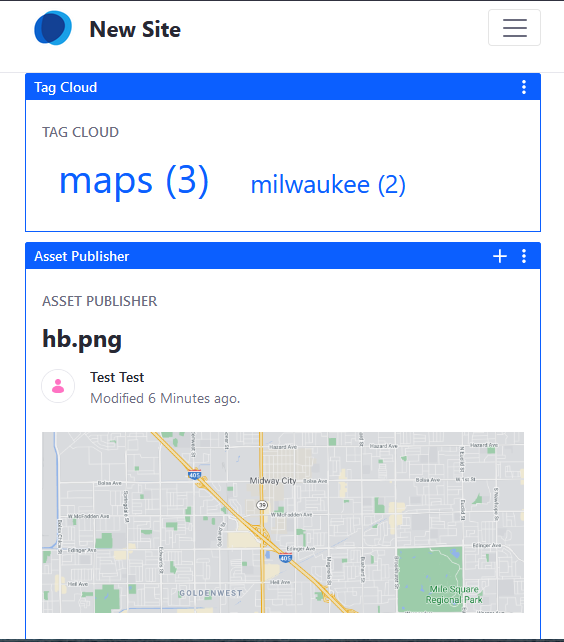

# Building a Responsive Site Overview

Now more than half of all page views in the world come from mobile devices like phones and tablets. As you build Sites in DXP, remember that the Sites should look good when viewed by a mobile device as it is on a Desktop. DXP can provide the best experience possible no matter what device you're using.

Out of the box, there are several features that help make your pages look just as good and have the same functionality on mobile devices as they do on a desktop:

* DXP widgets and custom widgets that use Liferay's UI frameworks automatically scale to fit the screen size.

    

* UI elements like the navigation and Product Menu automatically adjust to remain usable on smaller screens.

    

* When the screen width is low, Liferay combines columns so that all content remains legible.

   

* For web developers, DXP's theme tools provide a number of tools to help ensure optimum mobile performance.

For most business users, this means that all you need to do to display pages on Mobile device is to create a page. However, you also have tools available to verify that everything displays as intended. The Device Simulator () is a powerful tool that shows you how pages look on different devices.

## Using the Device Simulator

When creating a page or reviewing a page before it is published, one very important tools is the Device Simulator found in the top right corner of every page. The simulator lets you view the current page in a number of resolutions based on different display types. There are three predefined options:

* **Desktop:** Fixes the width to display the page at full size.

* **Tablet:** Puts your page in a box as if it is being displayed on a tablet. It also activates some of DXP's built-in mobile features.

* **Mobile:** Puts your page in an even smaller box to demonstrate how the page looks to your average smartphone user.

There are also two options available to display:

* **AutoSize:** Provides another way to view the default behavior where the page shrinks and grows based on the width of the browser window.

* **Custom:** Lets you enter a specific size for testing and fixes the height and width of the display.

Because modern mobile browsers are built on the same technology as desktop browsers, the behavior you see in the simulator should match the experience of users on mobile devices. In addition to making sure the basic layout looks good and that all functionality remains, it's also important to make sure that automatic features---like how columns are combined at lower resolutions---don't have unintended effects.

## Designing Mobile Friendly Pages

DXP provides the tools you need, but building pages that provide a good experience across all kinds of devices still means working across all levels of web development and publishing. Theme developers must create themes that use Liferay DXP's frameworks to scale content well across all kinds of displays. Designers must have multiple screen sizes in mind when designing pages. And before anything it published it must be thoroughly reviewed to make sure that it provides the best experience to all of your users.

## Using the Liferay Mobile Detection Device App

Each DXP Site has Mobile Device Families configuration settings. You can create mobile device rules which govern the Site's and Page's behavior when the site detects a mobile device. There are many different devices, each with its own characteristics. Therefore, you need a way to find out the characteristics of the device. While some of the characteristics are provided by the device, most are not. For this reason, there are databases that contain information about thousands of devices. These databases make it possible to learn every detail about a device from the device type. DXP's Mobile Device Rules can connect to device databases so that you can use their device characteristics in your rules.

Liferay offers a Mobile Device Detection app which can be deployed to DXP. This app provides the device detection database that is required to detect which mobile devices are accessing it. You must install [the lite version of LMDD](https://web.liferay.com/marketplace/-/mp/application/92831494) before you can install [the enterprise version](https://web.liferay.com/marketplace/-/mp/application/35419014).

Once the app is deployed, whole Sites or individual pages can be configured for mobile device families. A family describes a group of devices. You can set rules that describe a category of devices, such as all Android devices or all iOS tablets. You can define as many rules in a family as you need to classify all the devices for which you'd like to define actions. Families can be prioritized to determine which one applies to a given page request.

## Additional Information

* [Creating Mobile Device Rules](./creating-mobile-device.rules.md)
* [Mobile Device Actions Reference](./mobile-device-actions-reference.md)
