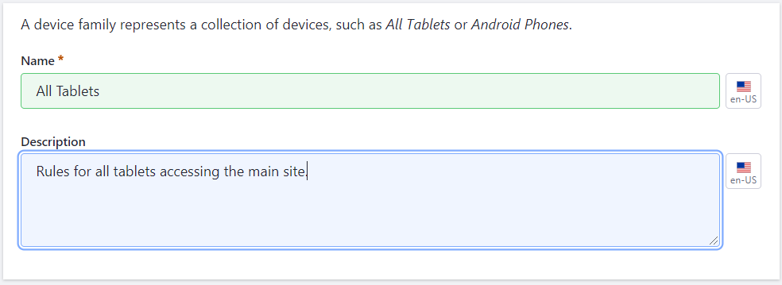
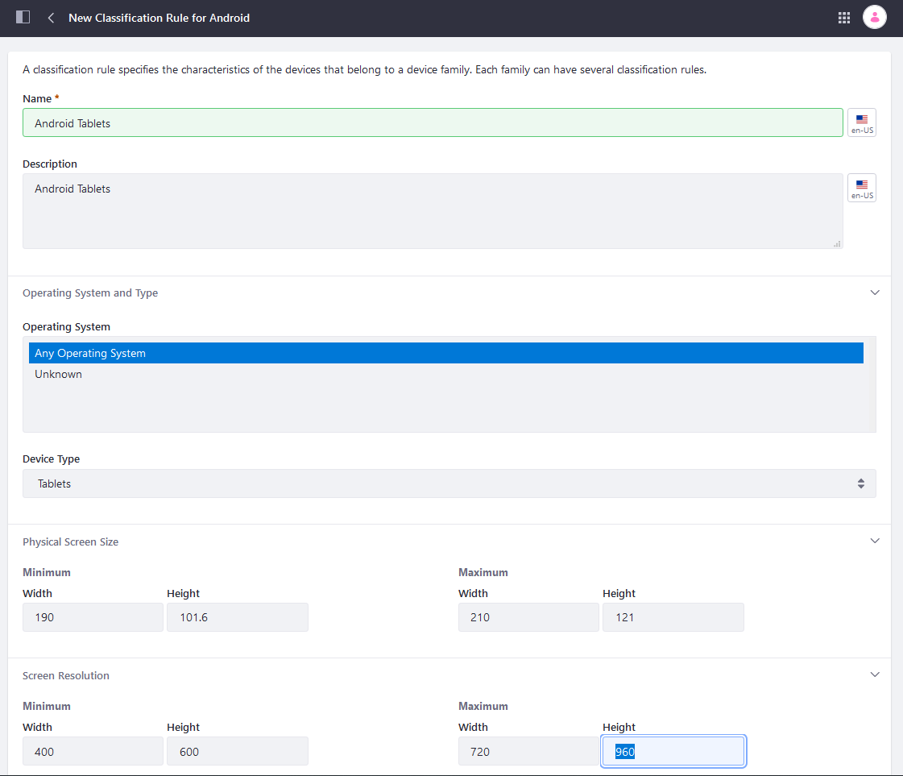
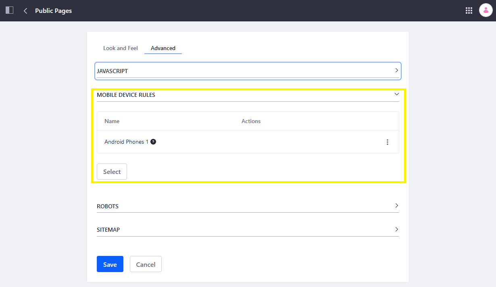
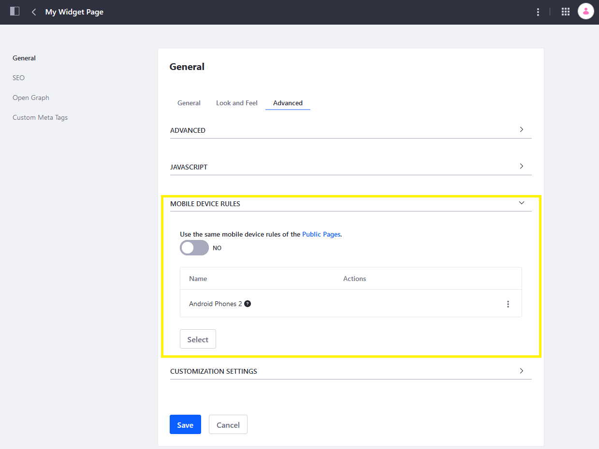
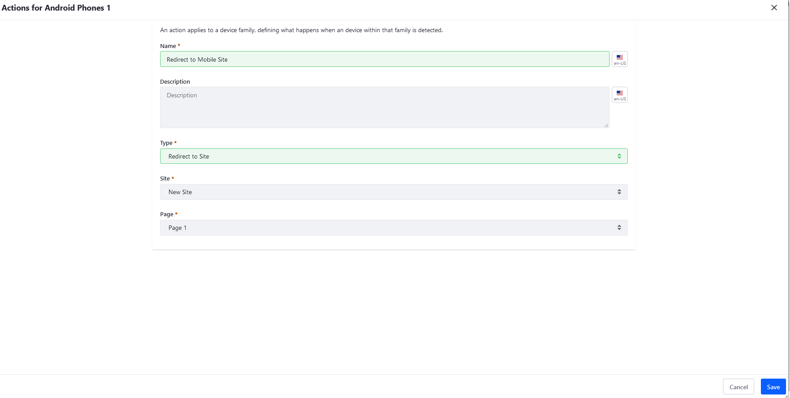

# Creating Mobile Device Rules

With mobile device rules, you can alter what gets displayed based on the device being used to access DXP. For instance, you can configure the look and feel of pages accessed by smartphone or tablet users differently from those accessed by users on a computer.

To configure mobile device rules, you need a way to find out the characteristics of the device. While some of the characteristics are provided by the device, most are not. For this reason, there are databases that contain information about thousands of devices. These databases make it possible to learn every detail about a device from the device type. DXP's Mobile Device Rules can connect to device databases so that you can use their device characteristics in your rules.

## Prerequisites

For the features described in this article to work, you must install the Liferay Mobile Device Detection (LMDD) app from Liferay Marketplace. This app provides the device detection database that's required to detect which mobile devices are accessing it. You must install [the lite version of LMDD](https://web.liferay.com/marketplace/-/mp/application/92831494) before you can install [the enterprise version](https://web.liferay.com/marketplace/-/mp/application/35419014).

## Creating a Mobile Device Family

Before creating [mobile device actions](#adding-mobile-device-actions), create a Mobile Device Family; a Mobile Device Family is a group of mobile device actions based on the type of device. For example, create a group for all Android devices; if DXP detects that an Android device is accessing the web page, it redirects the site visitor to a mobile-friendly page.

To create a Mobile Device Family:

1. Navigate to the desired site (in this case, use the DXP Guest site).
1. Click the () icon.
1. Click *Configuration*
1. Click *Mobile Device Families*.
1. Click *Add* button () to add a *New Device Family*.
1. Enter a *Name* and *Description*.
1. Click *Save*.
1. Click on the name of the Mobile Device Family to access the rules page.

    

The rules defined for a family, along with the priorities of the families selected for a particular Site or page, determine which family's actions are applied to a given request. From the New Classification Rule page for a specific rule set, you can add a rule by specifying an operating system, rule type, physical screen size, and screen resolution. Remember that you can add as many rules to a family as you need in order to classify the devices on which you'd like to take actions.

1. Click on the *Add* button () to add a new rule.
1. Enter a *Name* and *Description*.
1. Select the classifications you want for this rule from *Operating System and Type*, *Physical Screen Size*, and *Screen Resolution*.

    

1. Click *Save*.

## Applying a Mobile Device Rule

You can add families to a Site, individual page, or page set from their respective configuration pages. To do it for a Page Set:

1. Go to *Site Builder* &rarr; *Pages* in your Site.
1. Click the () icon for the Public Pages.
1. Select the *Advanced* tab and open the *Mobile Device Rules* option in the bottom menu.
1. Click *Select* to open the list of families that can be applied.

    

1. Click *Save* when finished.

### Applying a Mobile Device to a Page

You can configure each page to inherit the mobile device rules from the parent site or you can apply a different rule to specific pages.

To configure a mobile device rule for a specific page:

1. Go to *Site Builder* &rarr; *Pages* in your Site.
1. Click on the  icon next to the desired page then *Configure*.
1. Click the *Advanced* tab.
1. Expand the *Mobile Device Rules* section.
1. Side the toggle to *NO* to choose a different mobile device rule from the parent site.
1. Click *Select*.

    

1. Click *Save* when finished.

## Adding Mobile Device Actions

Once you've created some mobile device families and added some rules to them, add mobile device actions. These actions defined for a family determine what happens to a request when the device is detected and the family has been found to apply.

```tip::
   The Audience Targeting application offers a *Device* rule that evaluates whether a User is accessing content using a particular device family. This rule is integrated with the Mobile Device Families app.
```

You can add Mobile Device Actions to a Page Set or to a specific page.

To add actions to a Mobile Device Rule on a Site:

1. Open the *Site Administration* menu for the DXP Guest Site.
1. Click *Site Builder* &rarr; *Pages*.
1. Click the () icon next to *Public Pages*.
1. Click the *Advanced* tab.
1. Expand the *Mobile Device Rules* section.
1. Click *Options* () &rarr; *Manage Actions* next to the device family that you wish to add an action for.
1. Click *Add Action*.
1. Enter a *Name* and *Description*.
1. Select a *Type* (for example, *Redirect to Site*). See the [Mobile Device Actions Reference](./mobile-device-actions-reference.md) to learn more about the other Types.
1. Select the desired Site where visitors will be redirected to.
1. Select the default landing page on the Site.

    

1. Click *Save* when finished.

The Mobile Device Action has been added to this Site.

## Developing Mobile Device Rules

You'll notice that the classification rule are characterized as a *Simple Rule*. Only Simple Rules are included with DXP, but the rules are designed to be extensible for developers.

## Additional Information

* [Building a Responsive Site Overview](./building-a-responsive-site-overview.md)
* [Mobile Device Actions Reference](./mobile-device-actions-reference.md)
