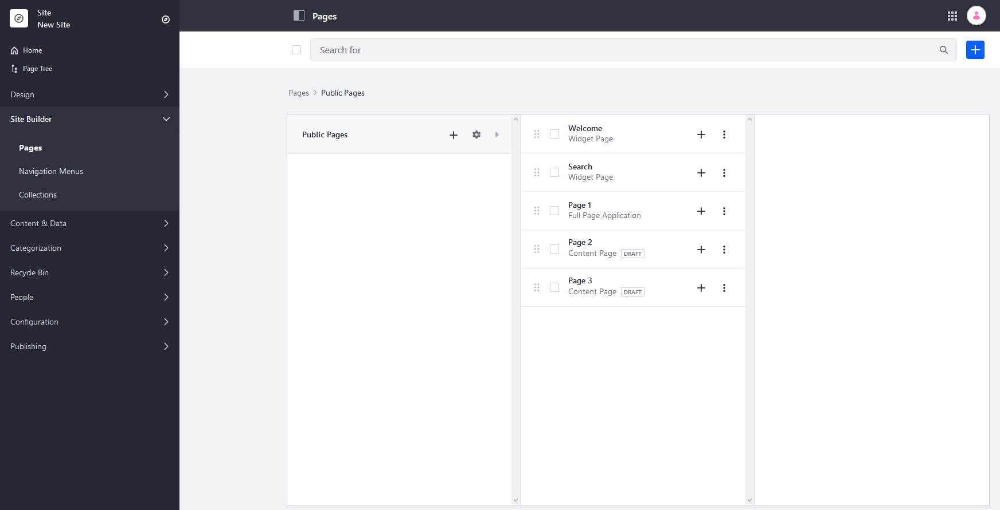
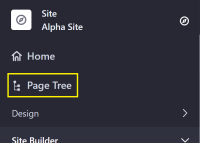

# Managing Site Navigation

Liferay DXP provides powerful tools for creating and organizing pages. You can build everything from a simple, flat Site navigation to a complex hierarchy with tree of sub-pages nested down many levels.

In DXP, you can create Navigation Menus separate from your page hierarchy. Here, you can create a one-off landing page, or create multiple navigation menus: a main menu, secondary menus, footer menus, and custom menus.

Menus can differ by page: landing pages can show a simple list of frequently visited pages, and the rest can appear in secondary navigation. You can also create specific menus for different landing pages to direct users to content that is relevant to them.

The _Site Builder_ menu is where you can create and organize your site pages and _Navigation Menus_.

## Managing Pages

The Site hierarchy as displayed on _Site Builder_ &rarr; _Pages_ menu is the main reference for the organization of pages on that Site. While Navigation Menus are customized to show some of the pages, this menu is always the primary reference for the pages on your Site.

New pages are created on the _Site Builder_ &rarr; _Pages_ menu. Pages can be created as _Public Pages_ which anyone can view, or _Private Pages_ which can only be viewed by Site Members. See [Adding a Page to a Site](../creating-pages/adding-pages/adding-a-page-to-a-site.md) to learn how to add a page.

## Using Navigation Menus

See [Using Navigation Menus](./using-navigation-menus.md) to learn how to create Navigation Menus and deploy them on a Site page. See the [Navigation Menu Widget Reference](./navigation-menu-widget-reference.md) to learn more about how to configure the _Navigation Menu_ widget.

## Using the Page Tree

Users can view and configure the pages in each Site in a vertical hierarchy.

To access the Page Tree:

1. Navigate to the your Site's _Site Administration_.
1. Click _Page Tree_.

    

1. The left menu displays the Site's pages and child pages:

    

In the Page Tree view, users can still add more pages or more child pages, configure a page, and toggle between Public and Private Pages.

## Using Collections

See [About Collections and Collection Pages](../../content-authoring-and-management/collections-and-collection-pages/about-collections-and-collection-pages.md) to learn more about Collections and how to create them.

## Additional Information

* [Adding a Page to a Site](../creating-pages/adding-pages/adding-a-page-to-a-site.md)
* [Using Navigation Menus](./using-navigation-menus.md)
* [Managing Page Hierarchies](./managing-page-hierarchies.md)
